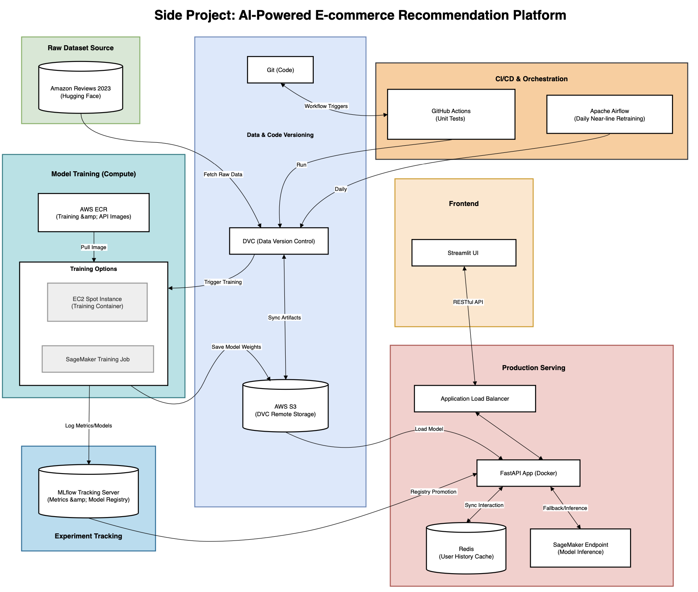

# MLOps E-commerce Recommendation System

This project implements a production-grade MLOps pipeline for an e-commerce recommendation system. It utilizes a Transformer-based model with Grouped Query Attention (GQA) and KV Cache to provide high-performance, personalized recommendations. The system integrates data versioning, automated retraining, experiment tracking, and cloud-native deployment.

## System Architecture & Tech Stack

### Architecture Diagram


* **Model Architecture**: Transformer-based recommender featuring **Grouped Query Attention (GQA)** and **KV Cache** for optimized inference latency.
* **Data & Model Versioning**: **DVC (Data Version Control)** paired with Git for reproducible experiments and artifact management.
* **Orchestration**: **Apache Airflow** managing the "Near-line" retraining loop and data extraction from Redis.
* **Tracking & Registry**: **MLflow** for hyperparameter logging, metric visualization, and model lifecycle management (Staging/Production).
* **Backend & Frontend**: **FastAPI** for high-concurrency inference and **Streamlit** for a simulated marketplace UI.
* **Infrastructure**: **Terraform** for AWS resource provisioning (ECS Fargate, ECR, SageMaker, S3).
* **CI/CD**: **GitHub Actions** for automated unit testing, model evaluation, and promotion.

---

## End-to-End Workflow

The system operates through a continuous feedback loop:

1.  **User Interaction**: Users browse and "Like" products on the **Streamlit UI**. These interactions are sent to the **FastAPI** backend and cached in **Redis**.
2.  **Near-line Data Extraction**: An **Airflow DAG** runs daily to extract fresh user behavior from Redis and save it as `events_processed.csv`.
3.  **DVC Pipeline (`dvc repro`)**:
    * **Preprocess**: Merges baseline Amazon Beauty data with new local events, generates item mappings, and splits data.
    * **Train**: Executes training on **AWS EC2 (GPU)** using a custom Docker image. The model is trained to predict the next item in a sequence.
    * **Evaluate**: Calculates NDCG@10 and Recall@10, comparing the new model against a popularity-based baseline.
4.  **Model Promotion**: **GitHub Actions** triggers upon a push to `main`. It runs the DVC pipeline, logs results to **MLflow**, and automatically promotes the model to `Production` status if it achieves a new best NDCG.
5.  **Deployment**: The **FastAPI** service supports **Hot-Reloading** to load the latest `Production` model without downtime. It can also delegate inference to a **SageMaker Endpoint** for scalable production workloads.

---

## Infrastructure & Deployment

### Cloud (AWS & Terraform)
The project uses Terraform to maintain Infrastructure as Code (IaC):
* **ECR**: Stores Docker images for Training, API, and UI.
* **ECS Fargate**: Hosts the API service with auto-scaling capabilities.
* **SageMaker**: Handles heavy-duty model hosting.
* **S3**: Serves as the remote storage for DVC and model artifacts.

### Local (Docker Compose)
For development and testing:
```bash
docker-compose up -d
```
* **Airflow Webserver**: `http://localhost:8080` (Manage DAGs)
* **FastAPI**: `http://localhost:8000` (Inference & Logs)
* **Streamlit**: `http://localhost:8501` (Marketplace Experience)
* **Redis**: `localhost:6379` (Session Cache)

---

## Performance Benchmarks

The implementation of **Grouped Query Attention (GQA)** significantly improves inference efficiency compared to standard (Vanilla) Transformers:

| Metric | Vanilla Transformer | GQA + KV Cache | Improvement |
| :--- | :--- | :--- | :--- |
| **Inference Latency** | ~198.37 ms | **~17.45 ms** | **~11.37x Speedup** |

*Results based on internal benchmark testing.*

---

## 🧪 Development & Testing

### 1. Local Environment Setup (Docker Compose)
To spin up the entire microservice ecosystem—including the **FastAPI** backend, **Streamlit** UI, **Redis** cache, and **Airflow** orchestrator—run the following command. The `--build` flag ensures that any local code changes in your Dockerfiles or requirements are incorporated:
```bash
docker-compose up --build -d
```

### 2. Reproducing the ML Pipeline (DVC)
This project uses **DVC** to manage the end-to-end machine learning lifecycle. Instead of manually running individual Python scripts, use `dvc repro` to trigger the pipeline defined in `dvc.yaml`. This ensures that data preprocessing, model training, and evaluation are executed in the correct order only when dependencies change:
```
# Execute the full pipeline (preprocess -> train -> evaluate)
dvc repro
```

### 3. Running Unit Tests
Before promoting a model or pushing code changes, run the automated test suite to verify that the Transformer architecture, output dimensions, and masking logic remain intact:
```
# Run unit tests located in the tests/ directory
pytest tests/
```

### 4. Data & Artifact Versioning
Since large datasets and model weights (`.pth` files) are not stored in Git, use DVC to synchronize these artifacts with the S3 remote storage:
```
# Pull data and model artifacts from S3
dvc pull

# Push newly generated models and metrics to S3
dvc push
```

### 5. Manual Training Trigger (Optional)
While the pipeline is typically managed by DVC or Airflow, you can still manually trigger a cloud-based training session on an AWS EC2 GPU instance for heavy-duty workloads:
```
python src/train_by_AWS.py
```